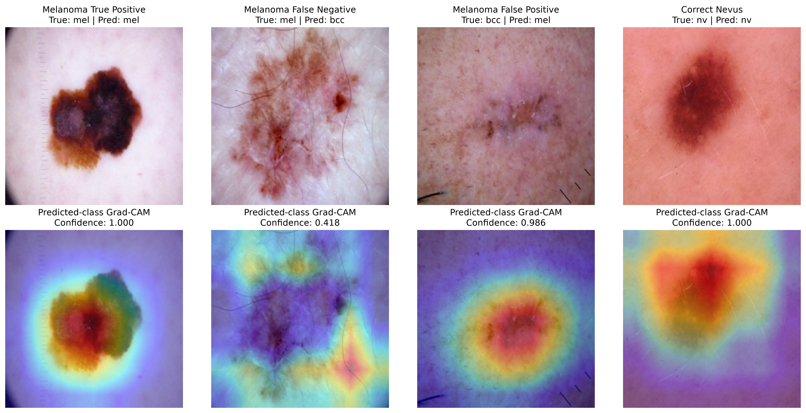

# Skin Lesion AI

An educational computer-vision and multimodal-AI project using the
HAM10000 dermatoscopic skin-lesion dataset.

The project explores the progression from conventional image
classification to transfer learning, model evaluation, explainability,
vision-language models (VLMs), multimodal instruction tuning, and
eventually NVIDIA NeMo and Nemotron tooling.

> **Research and educational use only.**
> This project is not intended for clinical diagnosis, medical
> decision-making, or patient care.

---

## Project Question

How do specialized computer-vision models and general-purpose
vision-language models compare on a domain-specific medical imaging
task, and can multimodal domain adaptation improve VLM performance?

The project follows this progression:

    HAM10000
        |
        v
    Dataset exploration
        |
        v
    Baseline CNN
        |
        v
    ResNet-18 transfer learning
        |
        v
    Medical-ML evaluation
        |
        v
    Grad-CAM explainability
        |
        v
    Zero-shot VLM experiments
        |
        v
    Multimodal instruction dataset
        |
        v
    NVIDIA NeMo + PEFT / LoRA
        |
        v
    Nemotron / structured reporting
        |
        v
    NVIDIA deployment tooling

---

## Dataset

The project uses the HAM10000 ("Human Against Machine with 10000
training images") dermatoscopic image dataset.

The dataset contains 10,015 images representing seven lesion
categories:

| Label | Category |
|---|---|
| `akiec` | Actinic keratosis / intraepithelial carcinoma |
| `bcc` | Basal cell carcinoma |
| `bkl` | Benign keratosis-like lesion |
| `df` | Dermatofibroma |
| `mel` | Melanoma |
| `nv` | Melanocytic nevus |
| `vasc` | Vascular lesion |

The dataset is highly imbalanced, with melanocytic nevi (`nv`)
representing approximately 67% of the images.

Because multiple images can correspond to the same lesion, the
train/validation/test split is performed at the **lesion level** to
prevent images of the same lesion from appearing in multiple splits.

HAM10000 does not provide a usable patient identifier in the metadata
used here, so lesion-level separation does not guarantee patient-level
independence.

### Split

| Split | Images |
|---|---:|
| Train | 7,002 |
| Validation | 1,532 |
| Test | 1,481 |

The raw dataset is intentionally excluded from this repository.

---


## Reproducing the Project

This section describes how to reproduce the project through Stage 7 from a fresh clone of the repository.

### 1. Clone the Repository

Clone the repository and enter the project directory:

```bash
git clone <REPOSITORY-URL>
cd skin-lesion-ai
```

The repository does **not** contain the raw HAM10000 images or trained model checkpoints because of their size.

---

### 2. Create the Conda Environment

The project was developed with Python 3.11.

Create the environment:

```bash
conda env create -f environment.yml
conda activate skin-lesion-ai
```

Verify that PyTorch imports successfully:

```bash
python -c "import torch; print(torch.__version__)"
```

If using an NVIDIA GPU, also check whether PyTorch can access CUDA:

```bash
python -c "import torch; print('CUDA available:', torch.cuda.is_available())"
```

GPU acceleration is strongly recommended for model training and the VLM experiments, but the dataset-exploration portions can run on CPU.

`environment-lock.yml` records the more detailed package environment used during development. It is primarily provided as a reproducibility/debugging reference rather than as the recommended environment installation file.

---

### 3. Download HAM10000

Download the HAM10000 dataset from Kaggle:

**Skin Cancer MNIST: HAM10000**

https://www.kaggle.com/datasets/kmader/skin-cancer-mnist-ham10000

The raw dataset is intentionally excluded from Git.

Place the downloaded and extracted files under:

```text
data/raw/ham10000/
```

The important files/directories should include:

```text
data/raw/ham10000/
├── HAM10000_metadata.csv
├── HAM10000_images_part_1/
└── HAM10000_images_part_2/
```

The exact Kaggle download may contain additional files. The notebooks primarily rely on the metadata CSV and the two image directories.

Before continuing, confirm that both image directories contain the HAM10000 `.jpg` files.

---

### 4. Start Jupyter

From the project root with the Conda environment activated:

```bash
jupyter notebook
```

Open the `notebooks/` directory.

The notebooks are numbered in the order in which they should be run:

```text
01_dataset_exploration.ipynb
02_baseline_cnn.ipynb
03_transfer_learning.ipynb
04_model_evaluation.ipynb
05_gradcam_explainability.ipynb
06_vision_language_model.ipynb
07_multimodal_dataset.ipynb
```

For the closest reproduction of the original workflow, run them in this order.

---

### 5. Stage 1 — Rebuild the Dataset Split

Run:

```text
notebooks/01_dataset_exploration.ipynb
```

This notebook:

- loads the HAM10000 metadata
- examines class imbalance
- examines the relationship between images and lesions
- creates a lesion-aware train/validation/test split
- verifies that lesion IDs do not overlap between splits
- writes the processed split metadata

The expected dataset contains:

```text
10,015 images
7,470 unique lesions
7 diagnostic classes
```

The expected split contains approximately:

| Split | Images |
|---|---:|
| Train | 7,002 |
| Validation | 1,532 |
| Test | 1,481 |

The resulting split file is:

```text
data/processed/metadata_splits.csv
```

A fixed random seed is used so the split can be reproduced.

Image paths in the processed CSVs are stored relative to the project
root (for example `data/raw/ham10000/HAM10000_images_part_1/ISIC_0027419.jpg`),
so the files work on any machine. Notebooks join them with
`PROJECT_ROOT` after loading.

The repository already contains the processed split used in the original experiments. Re-running Stage 1 allows a collaborator to reconstruct and verify it from the raw HAM10000 dataset.

---

### 6. Stage 2 — Train the Baseline CNN

Run:

```text
notebooks/02_baseline_cnn.ipynb
```

This trains a small convolutional neural network to establish a baseline before transfer learning.

The original experiment produced approximately:

| Metric | Validation Result |
|---|---:|
| Accuracy | 72.7% |
| Balanced accuracy | 34.3% |
| Macro F1 | 36.9% |

Exact results may vary slightly because of GPU behavior and other sources of nondeterminism.

The important result is the large difference between ordinary accuracy and balanced accuracy, demonstrating the effect of HAM10000's severe class imbalance.

---

### 7. Stage 3 — Train the ResNet-18 Models

Run:

```text
notebooks/03_transfer_learning.ipynb
```

This notebook performs several transfer-learning experiments using a pretrained ResNet-18:

1. frozen feature extractor
2. partial fine-tuning
3. class-weighted partial fine-tuning
4. full fine-tuning

Locally generated model checkpoints may include:

```text
models/resnet18_finetuned.pt
models/resnet18_finetuned_weighted.pt
models/resnet18_full_finetuned.pt
```

These files are intentionally excluded from Git because trained model weights are large and can be regenerated by running the notebook.

Later notebooks that load a checkpoint therefore require Stage 3 to have been run first unless the checkpoint is obtained separately.

---

### 8. Stage 4 — Evaluate the Selected Model

Run:

```text
notebooks/04_model_evaluation.ipynb
```

The final model is selected using validation performance before evaluating the held-out test set.

The original final test results were:

| Metric | Result |
|---|---:|
| Accuracy | 82.8% |
| Balanced accuracy | 64.3% |
| Macro precision | 71.8% |
| Macro recall | 64.3% |
| Macro F1 | 66.6% |
| Melanoma AUC | 0.905 |

Evaluation artifacts are written to `results/`.

Because the test set is intended to remain held out, it should not be used to tune model architecture, hyperparameters, prompts, or thresholds.

---

### 9. Stage 5 — Generate Grad-CAM Explanations

Run:

```text
notebooks/05_gradcam_explainability.ipynb
```

This notebook loads the trained ResNet-18 and generates Grad-CAM visualizations for representative predictions.

The notebook examines examples including:

- melanoma true positive
- melanoma false negative
- melanoma false positive
- correctly classified melanocytic nevus

The resulting comparison figure is:

```text
results/gradcam_case_comparison.png
```



Grad-CAM is used here to inspect model behavior. It should not be interpreted as proof that the highlighted regions correspond to clinically meaningful structures.

---

### 10. Stage 6 — Run the Zero-Shot VLM Experiments

Run:

```text
notebooks/06_vision_language_model.ipynb
```

This stage uses small Hugging Face SmolVLM models to investigate:

- image description
- instruction following
- zero-shot HAM10000 classification

The models used in the original experiments were:

```text
HuggingFaceTB/SmolVLM-256M-Instruct
HuggingFaceTB/SmolVLM2-500M-Video-Instruct
```

The model files are downloaded automatically through Hugging Face when the notebook is run for the first time and are not stored in this Git repository.

A fixed balanced sample of 35 test images was used for the small zero-shot classification experiment.

Original results:

| Metric | SmolVLM 256M | SmolVLM2 500M |
|---|---:|---:|
| Images | 35 | 35 |
| Strict accuracy | 14.3% | 11.4% |
| Invalid-format outputs | 5 | 0 |
| Average inference time | 0.62 s/image | 0.68 s/image |

The 500M model produced better output-format compliance but collapsed heavily toward a small subset of classes.

These experiments establish the **zero-shot VLM baseline** that later domain-adaptation experiments will be compared against.

---

### 11. Stage 7 — Rebuild the Multimodal Dataset

Run:

```text
notebooks/07_multimodal_dataset.ipynb
```

This converts the HAM10000 classification data into an instruction-tuning representation.

Conceptually:

```text
(image, class)
```

becomes:

```text
(image, instruction, response)
```

For example:

```text
Image:
ISIC_0026993.jpg

Instruction:
What lesion category is shown in this dermatoscopic image?

Response:
melanoma
```

The existing lesion-aware train/validation/test assignments are preserved rather than creating a new split.

The generated files are:

```text
data/processed/multimodal_dataset.csv

data/processed/multimodal/
├── train.csv
├── val.csv
└── test.csv
```

Expected record counts:

| Split | Records |
|---|---:|
| Train | 7,002 |
| Validation | 1,532 |
| Test | 1,481 |
| **Total** | **10,015** |

The training data contains the target response because it will eventually be used to compute a training loss.

During evaluation, the target response must **not** be supplied to the model. The model receives only the image and instruction; its generated response is compared with the stored target afterward.

---

### 12. Verify the Reproduction

After completing Stages 1–7, the project should contain approximately the following:

```text
skin-lesion-ai/
├── data/
│   ├── raw/
│   │   └── ham10000/
│   └── processed/
│       ├── metadata_splits.csv
│       ├── multimodal_dataset.csv
│       └── multimodal/
│           ├── train.csv
│           ├── val.csv
│           └── test.csv
├── models/
│   ├── resnet18_finetuned.pt
│   ├── resnet18_finetuned_weighted.pt
│   └── resnet18_full_finetuned.pt
├── notebooks/
│   ├── 01_dataset_exploration.ipynb
│   ├── 02_baseline_cnn.ipynb
│   ├── 03_transfer_learning.ipynb
│   ├── 04_model_evaluation.ipynb
│   ├── 05_gradcam_explainability.ipynb
│   ├── 06_vision_language_model.ipynb
│   └── 07_multimodal_dataset.ipynb
└── results/
    ├── gradcam_case_comparison.png
    ├── resnet18_final_test_metrics.csv
    ├── resnet18_finetuned_val_report.csv
    ├── stage6_vlm_classification_example.txt
    └── stage6_vlm_description_example.txt
```

The raw images and trained `.pt` checkpoints exist locally but are excluded from Git.

---

## Reproduction Notes

Some numerical differences between machines are normal.

Possible sources include:

- GPU architecture
- CUDA and PyTorch versions
- nondeterministic GPU operations
- dependency-version differences
- model downloads or library updates

The goal is therefore not necessarily bit-for-bit identical output. A successful reproduction should recover the same dataset split, broadly similar ResNet performance, the same qualitative Grad-CAM workflow, the same zero-shot VLM evaluation procedure, and the same multimodal dataset structure.

For the original development environment, see:

```text
environment-lock.yml
```

For the recommended collaborator environment, use:

```text
environment.yml
```

---

## Stage 1 — Dataset Exploration

Notebook:

`notebooks/01_dataset_exploration.ipynb`

Work includes:

- metadata exploration
- class-distribution analysis
- image inspection
- lesion/image relationship analysis
- lesion-aware stratified train/validation/test splitting
- leakage checks

The resulting split metadata is stored under `data/processed/`.

---

## Stage 2 — Baseline CNN

Notebook:

`notebooks/02_baseline_cnn.ipynb`

A small convolutional neural network establishes an initial baseline.

Approximate validation results:

| Metric | Result |
|---|---:|
| Accuracy | 72.7% |
| Balanced accuracy | 34.3% |
| Macro F1 | 36.9% |

The large gap between accuracy and balanced accuracy demonstrates the
effect of HAM10000's class imbalance.

---

## Stage 3 — Transfer Learning

Notebook:

`notebooks/03_transfer_learning.ipynb`

A pretrained ResNet-18 is adapted to HAM10000.

Experiments include:

1. frozen feature extractor
2. partial fine-tuning
3. class-weighted partial fine-tuning
4. full fine-tuning

The experiments demonstrate the tradeoff between overall accuracy and
minority-class performance.

Model checkpoints are excluded from normal Git history.

---

## Stage 4 — Model Evaluation

Notebook:

`notebooks/04_model_evaluation.ipynb`

The final model was selected using validation performance before
evaluating the held-out test set.

Final ResNet-18 test results:

| Metric | Result |
|---|---:|
| Accuracy | 82.8% |
| Balanced accuracy | 64.3% |
| Macro precision | 71.8% |
| Macro recall | 64.3% |
| Macro F1 | 66.6% |
| Melanoma AUC | 0.905 |

The evaluation emphasizes that accuracy alone is insufficient for an
imbalanced medical-imaging dataset.

---

## Stage 5 — Explainability

Notebook:

`notebooks/05_gradcam_explainability.ipynb`

Grad-CAM is used to visualize image regions associated with ResNet-18
predictions.

Cases examined include:

- melanoma true positive
- melanoma false negative
- melanoma false positive
- correctly classified melanocytic nevus

Example visualizations are stored in `results/`.

Grad-CAM is treated as a model-inspection technique rather than evidence
of clinical reasoning.

### Grad-CAM Example

The figure below compares Grad-CAM visualizations for representative
classification outcomes, including a melanoma true positive, melanoma
false negative, melanoma false positive, and correctly classified
melanocytic nevus.


The visualizations help inspect which image regions influenced the
model's predictions. They should not be interpreted as evidence that
the model is identifying clinically meaningful structures.

Grad-CAM is used here as a model-inspection and explainability technique,
not as evidence of clinical reasoning or diagnostic validity.

---

## Stage 6 — Vision-Language Models

Notebook:

`notebooks/06_vision_language_model.ipynb`

Zero-shot experiments were performed with small SmolVLM models.

The experiments explored two capabilities:

- natural-language image description
- zero-shot lesion classification

A fixed balanced sample of 35 test images (5 per class) was used for a
small controlled classification experiment.

### Zero-Shot Results

| Metric | SmolVLM 256M | SmolVLM2 500M |
|---|---:|---:|
| Images | 35 | 35 |
| Strict accuracy | 14.3% | 11.4% |
| Invalid-format outputs | 5 | 0 |
| Average inference time | 0.62 s/image | 0.68 s/image |

The 500M model produced valid output formatting for all 35 examples but
showed severe class bias: 27 of 35 images were classified as `akiec`
and the remaining 8 as `bkl`.

The experiment illustrates an important distinction:

**General multimodal capability does not imply domain-specific
classification expertise.**

The VLM also generated plausible-sounding but unsupported medical
language during image-description experiments, reinforcing the need to
separate fluent language generation from grounded or clinically valid
interpretation.

Example VLM artifacts are stored in `results/`.

---

## Stage 7 — Multimodal Dataset Construction

Notebook:

`notebooks/07_multimodal_dataset.ipynb`

HAM10000 is transformed from a conventional classification dataset:

    (image, class)

into an instruction-tuning representation:

    (image, instruction, response)

For example:

    USER:
    [dermatoscopic image]

    What lesion category is shown in this dermatoscopic image?

    ASSISTANT:
    melanoma

Multiple equivalent instruction formulations are assigned
reproducibly while retaining one record per image.

The original lesion-aware train/validation/test assignments are
preserved.

Processed multimodal files are stored under:

`data/processed/multimodal/`

---

## Next — NVIDIA NeMo

The next stage will investigate parameter-efficient adaptation of a VLM
using the NVIDIA ecosystem.

Planned topics include:

- NVIDIA NeMo / NeMo AutoModel
- parameter-efficient fine-tuning (PEFT)
- Low-Rank Adaptation (LoRA)
- multimodal model adaptation
- comparison with the zero-shot VLM baseline
- GPU-memory and training-efficiency considerations

The project will then explore where Nemotron models can contribute to
structured explanation or reporting and, where appropriate, NVIDIA
deployment tooling such as NIM or Triton.

---

## Stage 8 Hardware and Software Environment

Before starting NeMo / LoRA work, the GPU and software stack were
checked and recorded here. This matters for three reasons:

- **GPU memory determines what is feasible.** VLM fine-tuning is
  primarily limited by VRAM. The amount available decides which models
  can be used, whether LoRA can run in full bf16 precision or requires
  quantization (QLoRA), and what batch size and image resolution are
  practical.
- **Version compatibility.** NVIDIA libraries such as NeMo are built
  against specific PyTorch and CUDA versions, and newer GPU
  architectures (such as Blackwell) require recent CUDA builds.
  Recording the working combination helps avoid installing a package
  that silently downgrades PyTorch or breaks GPU support.
- **Reproducibility across collaborators.** Results and training
  configurations may differ between machines. Recording the hardware
  makes it possible to explain differences in speed, memory usage, or
  numerical results, and to check whether a configuration will fit on
  another collaborator's GPU.

Checked on 2026-09-24:

| Component | Value |
|---|---|
| GPU | NVIDIA RTX PRO 5000 Blackwell Generation Laptop GPU |
| VRAM | 24 GB (23.89 GB reported by PyTorch) |
| Compute capability | 12.0 (Blackwell) |
| NVIDIA driver | 596.53 |
| Max CUDA supported by driver | 13.2 |
| PyTorch | 2.14.0+cu130 |
| CUDA version (PyTorch build) | 13.0 |
| bf16 support | Yes |
| OS | Windows + WSL2 (Linux) |
| Conda environment | `skin-lesion-ai` (Python 3.11) |

Stages 1–7 were developed on an NVIDIA GeForce RTX 3050 Laptop GPU
with 4 GB VRAM.

To reproduce this check:

```bash
nvidia-smi
python -c "import torch; print(torch.__version__, torch.version.cuda, torch.cuda.is_available(), torch.cuda.get_device_name(0))"
```

This table should be updated if PyTorch is upgraded or NeMo is
installed, since NeMo may install its own PyTorch version.

---

## Project Structure

    skin-lesion-ai/
    ├── data/
    │   ├── raw/                 # HAM10000 (not tracked by Git)
    │   └── processed/           # Splits and multimodal metadata
    ├── models/                  # Local model checkpoints (not tracked)
    ├── notebooks/
    │   ├── 01_dataset_exploration.ipynb
    │   ├── 02_baseline_cnn.ipynb
    │   ├── 03_transfer_learning.ipynb
    │   ├── 04_model_evaluation.ipynb
    │   ├── 05_gradcam_explainability.ipynb
    │   ├── 06_vision_language_model.ipynb
    │   └── 07_multimodal_dataset.ipynb
    ├── results/                 # Figures, metrics, and example outputs
    ├── src/                     # Reusable source code
    ├── environment.yml
    ├── environment-lock.yml
    └── README.md

---

## Environment

The project was developed using Python 3.11 with PyTorch and CUDA.

Create the Conda environment with:

    conda env create -f environment.yml
    conda activate skin-lesion-ai

`environment.yml` contains the primary project dependencies.

`environment-lock.yml` captures the more detailed environment used
during development and is retained for reproducibility and debugging.

GPU acceleration is recommended but is not required for dataset
exploration.

---

## Data Setup

HAM10000 is not included in this repository because of its size.

After obtaining the dataset, place the raw files under:

    data/raw/ham10000/

The expected structure includes the HAM10000 metadata CSV and image
directories.

The notebooks document the subsequent preprocessing and split
construction.

---

## Collaboration

Development is organized so new experiments can be implemented on
feature branches and reviewed before merging into `main`.

The upcoming NVIDIA work is intended to provide a clean transition from
the current PyTorch/Transformers baseline into NeMo-based multimodal
adaptation.

---

## Acknowledgments

Stages 1–7 were co-developed with Matt Smith.

---

## Current Status

Stages 1–7 establish the pre-NeMo baseline:

- HAM10000 exploration and leakage-aware splitting
- CNN baseline
- ResNet-18 transfer learning
- held-out model evaluation
- Grad-CAM explainability
- zero-shot SmolVLM experiments
- multimodal instruction-dataset construction

The next major milestone is **Stage 8: NVIDIA NeMo and
parameter-efficient VLM adaptation**.